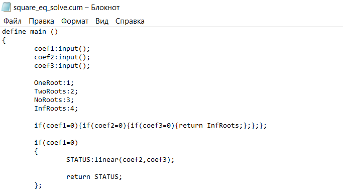
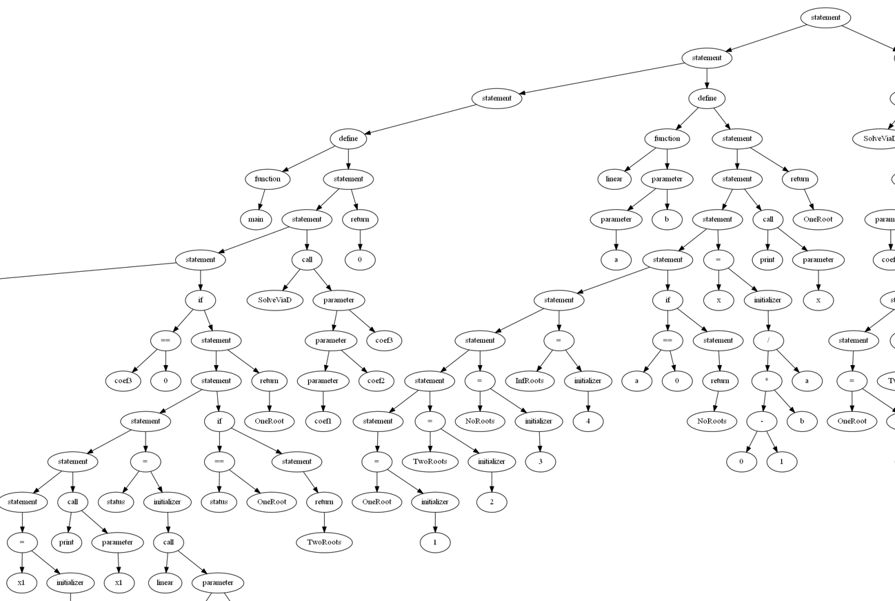
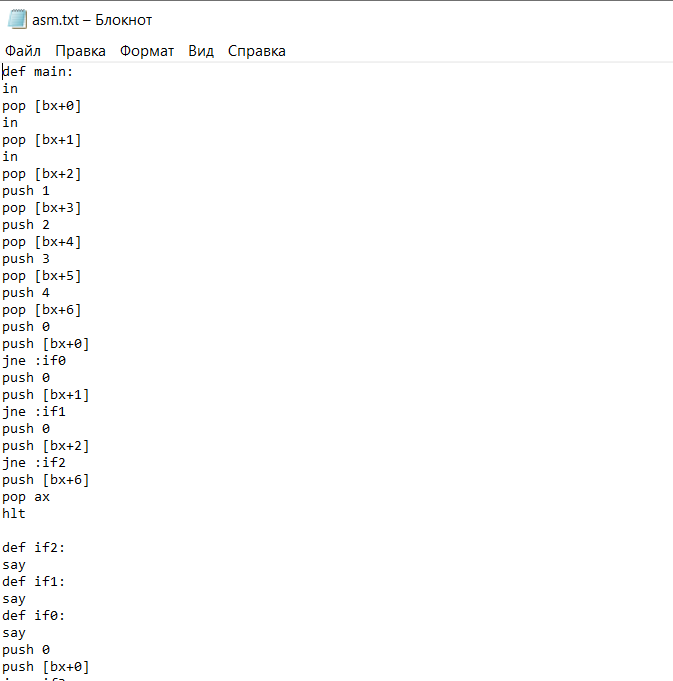

# MA_LANGUAGE

## About
In this project I developed a tiny programming language.
To be exact I:
### 1. Developed language's grammar (details will be added later, but you can try to get it by exploring [great_grammar](great_grammar.cpp)).



### 2. Created frontend for this language. I made RDP (recursive descent parser). As a result i got AST (abstract syntax tree)



### 3.Created backend that translates AST to assembler of [my virtual machine](https://github.com/matmuher/flip-flop/tree/main/processor)


## Programs example:

### Factorial:

```
define main ()
{
	n:10;
	n:fact(n);
	print(n);
	return 0;
}!

define fact (n)
{
	SnowBall:1;
	x:1;
	while(x<n+1)
	{
	SnowBall:SnowBall*x;
	x:x+1;
	};

	return SnowBall;
}!
$
```

### Fibbonachi

```
define main ()
{
	n:10;
	FibVal:Fib(n);
	print(FibVal);
	return 0;
}!

define Fib (n)
{
	if(n=1){return 1;};
	if(n=2){return 1;};

	return Fib(n-1)+Fib(n-2);
}!
$
```

### Square equation solve

```
define main ()
{
	coef1:input();
	coef2:input();
	coef3:input();
	
	OneRoot:1;
	TwoRoots:2;
	NoRoots:3;
	InfRoots:4;

	if(coef1=0){if(coef2=0){if(coef3=0){return InfRoots;};};};

	if(coef1=0)
	{	
		STATUS:linear(coef2,coef3);
		
		return STATUS;
	};

	if(coef2=0)
	{
		CoefDiv:coef3/coef1*(0-1);
		
		if(CoefDiv>(0-1))
		{
			x1:sqrt(CoefDiv);
			x2:(0-1)*x1;
	
			print(x1,x2);
			return TwoRoots;
		};
		coef1:33;
		return NoRoots;
	};

	if(coef3=0)
	{
		x1:0;
		print(x1);
		STATUS:linear(coef1,coef2);
		
		if(STATUS=OneRoot)
		{
			return TwoRoots;
		};

		return OneRoot;
	};

	

	STATUS:SolveViaD(coef1,coef2,coef3);

	return STATUS;	
}!

define linear (a,b)
{
	OneRoot:1;
	NoRoots:3;

	
	if(a=0)
	{
		return NoRoots;
	};
	
	x:(0-1)*b/a;
	print(x);
	
	return OneRoot;
}!

define SolveViaD (coef1,coef2,coef3)
{
	TwoRoots:2;
	NoRoots:3;

	D:coef2*coef2-4*coef1*coef3;
	sqrtD:sqrt(D);
	Coef1Mlt2:2*coef1;
	
	if(D>(0-1))
	{
		x1:((0-coef2)+sqrtD)/Coef1Mlt2;
		x2:((0-coef2)-sqrtD)/Coef1Mlt2;

		print(x1,x2);
	
		return TwoRoots;
	};

	return NoRoots;	
}!
$
```
